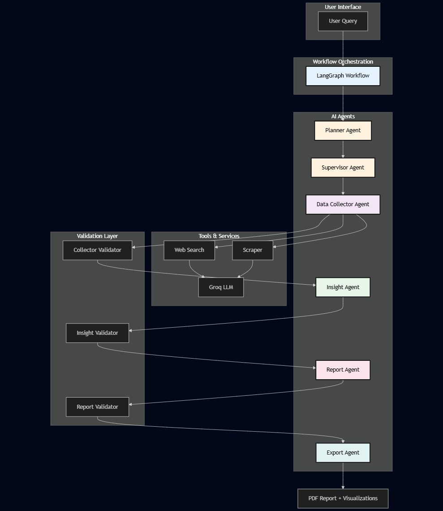
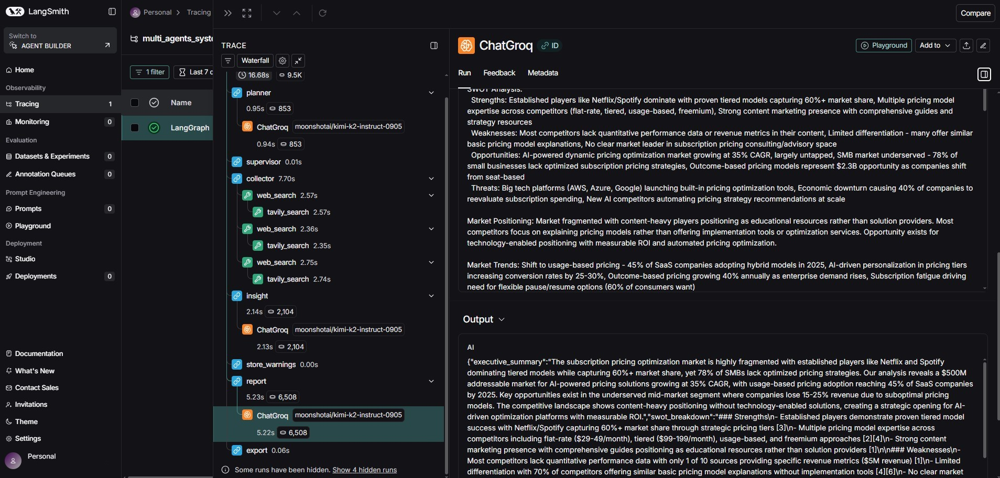
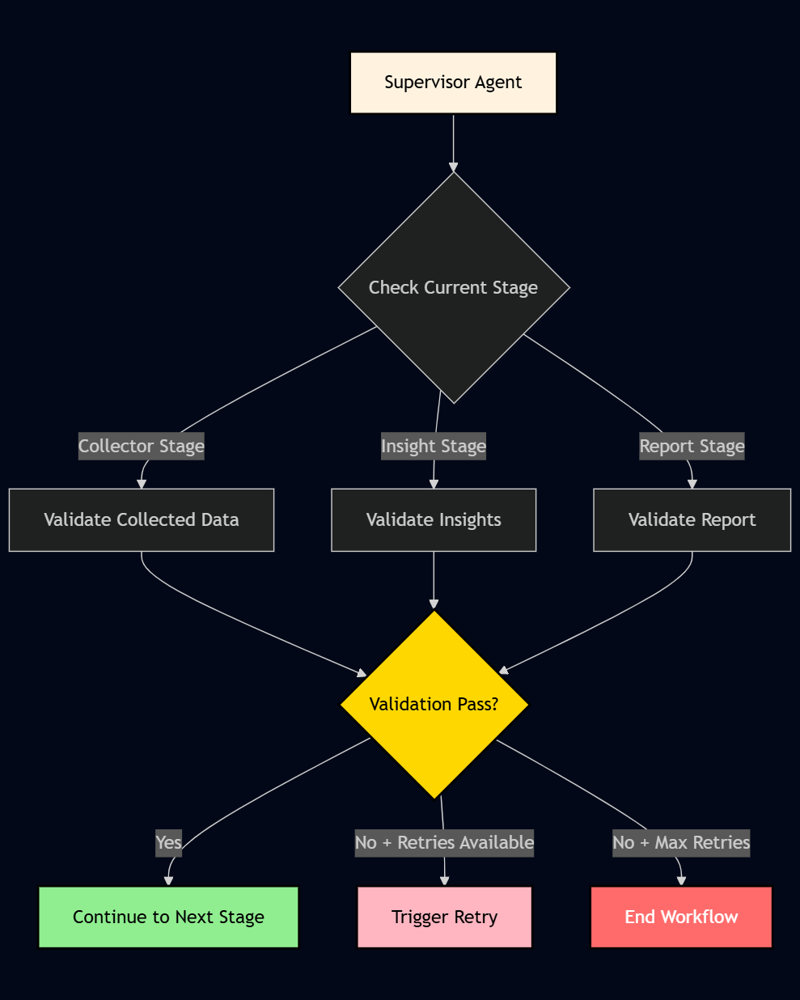

# Competitor Analysis Multi-Agent System


A robust, scalable multi-agent system using LangGraph for automated competitor analysis with validation gates, retry mechanisms, and quality assurance.


## Overview

This system leverages multiple AI agents working together to perform comprehensive competitor analysis:  

1. **Planner Agent**: Breaks down user requests into actionable tasks
2. **Supervisor Agent**: Controls workflow flow and applies business rules
3. **Data Collector Agent**: Gathers competitor data using web search and scraping
4. **Insight Agent**: Transforms raw data into business insights and SWOT analysis
5. **Report Agent**: Generates comprehensive formatted reports
6. **Export Agent**: Exports reports to PDF

The system uses LangGraph to orchestrate these agents through a stateful workflow with validation gates at each stage and automatic retry mechanisms for error recovery.

## Features

- 🤖 **Multi-Agent Architecture**: Specialized agents for each workflow stage
- 🔄 **Intelligent Retry Logic**: LLM-powered query improvement based on validation errors with automatic fallback
- ✅ **Validation Gates**: Quality checks at each workflow stage with immutable state management
- 📊 **Structured Output**: Pydantic models ensure type safety and validation
- 📄 **Professional PDF Export**: Advanced PDF generation with branding, layout customization, and professional features
  - Custom branding (logos, colors, fonts)
  - Multiple cover page templates (default, executive, minimal)
  - Branded headers and footers
  - PDF metadata and bookmarks
  - Flexible page layouts (size, orientation, margins)
- 🛡️ **Error Handling**: Comprehensive error handling with decorator-based approach and custom exception hierarchy
- 🚀 **Performance Optimizations**:
  - **LLM Response Caching**: In-memory caching to reduce redundant API calls
  - **Rate Limiting**: Automatic retry with exponential backoff for LLM API calls
  - **Async Support**: Hybrid async/sync execution for I/O-bound operations
  - **State Compression**: External storage for large state data to keep state size manageable
  - **Parallel Test Execution**: Fast test runs with pytest-xdist
- 📊 **Monitoring & Metrics**: Detailed tracking of execution time, token usage, and API calls
- 🔍 **LangSmith Observability**: Optional integration with LangSmith for tracing, debugging, and monitoring LLM calls and agent operations
- 🔒 **Security**: Input validation and sanitization to prevent security issues
- 📝 **Comprehensive Testing**: Unit and integration tests with 80%+ coverage, parallel execution support
- 🔧 **Type Safety**: Full type hints throughout the codebase
- 📚 **Well Documented**: Google-style docstrings with usage examples
- 📋 **Agent Output Logging**: Automatic logging of agent outputs to timestamped files for debugging and analysis

## Architecture



### Key Components

- **Agents**: Self-contained units following the Agent Pattern
- **Tools**: Stateless functions for web search, scraping, and text processing
- **Validators**: Quality gates ensuring output meets standards
- **Nodes**: Pure functions wrapping agent execution
- **Workflow**: LangGraph StateGraph with conditional edges

## Installation

### Prerequisites

- Python 3.10 or higher
- Groq API key (for LLM)
- Optional: Tavily API key (for enhanced web search)
- Optional: LangSmith API key (for observability and tracing)

### Setup

1. **Clone the repository**:
   ```bash
   git clone https://github.com/ashrafyahya/multi_agent_system_project.git
   cd multi_agent_system_project
   ```

2. **Create a virtual environment**:
   ```bash
   python -m venv venv
   source venv/bin/activate  # On Windows: venv\Scripts\activate
   ```

3. **Install dependencies**:
   ```bash
   pip install -r requirements.txt
   ```

4. **Set up environment variables**:
   Create a `.env` file in the project root:
   ```env
   GROQ_API_KEY=your_groq_api_key_here
   LLM_MODEL=llama-3.1-8b-instant  # Primary fallback for all agents (recommended)
   
   # Optional: Override models for specific agents
   LLM_MODEL_PLANNER=llama-3.1-8b-instant
   LLM_MODEL_SUPERVISOR=llama-3.1-8b-instant
   LLM_MODEL_INSIGHT=llama-3.3-70b-versatile
   LLM_MODEL_REPORT=llama-3.3-70b-versatile
   LLM_MODEL_COLLECTOR=llama-3.1-8b-instant
   LLM_MODEL_EXPORT=llama-3.3-70b-versatile
   
   MAX_RETRIES=3
   LOG_LEVEL=INFO
   DATA_DIR=./data
   TAVILY_API_KEY=your_tavily_api_key_here
   
   # Performance & Quality Configuration
   LLM_CACHE_ENABLED=true
   LLM_CACHE_SIZE=128
   METRICS_ENABLED=true
   METRICS_EXPORT_PATH=./data/metrics
   USE_ASYNC=false
   INTELLIGENT_RETRY_ENABLED=true
   STATE_STORAGE_ENABLED=false
   STATE_STORAGE_TTL=86400
   
   # Input Validation
   MAX_QUERY_LENGTH=5000
   MIN_QUERY_LENGTH=10
   
   # LangSmith Observability (Optional)
   LANGSMITH_ENABLED=false
   LANGSMITH_API_KEY=your_langsmith_api_key_here
   LANGSMITH_PROJECT=multi-agent-system
   # LANGSMITH_ENDPOINT=https://api.smith.langchain.com  # Optional: custom endpoint
   ```

## Configuration

Configuration is managed through a centralized configuration system using Pydantic Settings. The system automatically loads configuration from environment variables and a `.env` file in the project root.

### Configuration System

The application uses a centralized `Config` class that:
- Automatically loads from `.env` file (if present)
- Falls back to environment variables
- Provides type-safe access to configuration values
- Validates configuration on load


### Required Configuration

- `GROQ_API_KEY`: Your Groq API key (required)
  - Must be set in `.env` file or environment variables
  - Automatically loaded by the configuration system

- `TAVILY_API_KEY`: Tavily API key for web search (required)
  - Required for competitor data collection
  - Must be set in `.env` file or environment variables
  - Automatically loaded by the configuration system

### Optional Configuration

- `LLM_MODEL`: Default LLM model for all agents (default: `llama-3.1-8b-instant`, fallback)
- `LLM_MODEL_PLANNER`: Model for Planner agent (optional, defaults to `llama-3.1-8b-instant`)
- `LLM_MODEL_SUPERVISOR`: Model for Supervisor agent (optional, defaults to `llama-3.1-8b-instant`)
- `LLM_MODEL_INSIGHT`: Model for Insight agent (optional, defaults to `llama-3.3-70b-versatile`)
- `LLM_MODEL_REPORT`: Model for Report agent (optional, defaults to `llama-3.3-70b-versatile`)
- `LLM_MODEL_COLLECTOR`: Model for Data Collector agent (optional, defaults to `llama-3.1-8b-instant`)
- `LLM_MODEL_EXPORT`: Model for Export agent (optional, defaults to `llama-3.3-70b-versatile`)
- `MAX_RETRIES`: Maximum retry attempts (default: 3, range: 1-10)
- `LOG_LEVEL`: Logging level (default: `INFO`, options: DEBUG, INFO, WARNING, ERROR, CRITICAL)
- `DATA_DIR`: Directory for temporary data (default: `./data`)
- `AGENT_LOG_DIR`: Directory for agent output log files (default: `./data/agent_logs`)
- `AGENT_LOG_ENABLED`: Enable/disable agent output logging (default: `true`)
- `LANGSMITH_ENABLED`: Enable/disable LangSmith tracing (default: `false`)
- `LANGSMITH_API_KEY`: LangSmith API key for authentication (optional, required if `LANGSMITH_ENABLED=true`)
- `LANGSMITH_PROJECT`: LangSmith project name for organizing traces (default: `multi-agent-system`)
- `LANGSMITH_ENDPOINT`: Custom LangSmith endpoint URL (optional, for self-hosted LangSmith)

### Validation Thresholds Configuration

The system provides configurable validation thresholds for quality control at each workflow stage. These can be adjusted via environment variables:

- `MIN_INSIGHTS`: Minimum number of total insights required (default: `8`, range: 1-100)
  - Includes SWOT items, trends, opportunities, and positioning
- `MIN_POSITIONING_LENGTH`: Minimum character length for positioning statement (default: `50`, range: 10-1000)
- `MIN_REPORT_LENGTH`: Minimum total character length for report (default: `1200`, range: 100-100000)
- `MIN_SWOT_ITEMS_PER_CATEGORY`: Minimum items per SWOT category (default: `2`, range: 1-50)
  - Applies to strengths, weaknesses, opportunities, and threats
- `MIN_TRENDS`: Minimum number of trends required (default: `2`, range: 1-50)
- `MIN_OPPORTUNITIES`: Minimum number of opportunities required beyond SWOT (default: `2`, range: 1-50)
- `MIN_COLLECTOR_SOURCES`: Minimum number of unique competitor sources (default: `4`, range: 1-100)

**Example Configuration:**
```env
MIN_INSIGHTS=10
MIN_POSITIONING_LENGTH=100
MIN_REPORT_LENGTH=2000
MIN_SWOT_ITEMS_PER_CATEGORY=3
MIN_TRENDS=3
MIN_OPPORTUNITIES=3
MIN_COLLECTOR_SOURCES=5
```

These thresholds ensure quality standards are met at each validation stage. Adjust them based on your specific requirements.

### Rate Limiting and Retry Configuration

The system includes automatic rate limiting and retry logic for LLM API calls to handle rate limits and transient failures gracefully:

- `LLM_RETRY_ATTEMPTS`: Maximum number of retry attempts for LLM API calls (default: `3`, range: 1-10)
- `LLM_RETRY_BACKOFF_MIN`: Minimum backoff time in seconds for exponential backoff (default: `1.0`, range: 0.1-60.0)
- `LLM_RETRY_BACKOFF_MAX`: Maximum backoff time in seconds for exponential backoff (default: `30.0`, range: 1.0-300.0)
- `INTELLIGENT_RETRY_ENABLED`: Enable/disable intelligent retry using LLM to improve queries (default: `true`)

**Example Configuration:**
```env
LLM_RETRY_ATTEMPTS=5
LLM_RETRY_BACKOFF_MIN=2.0
LLM_RETRY_BACKOFF_MAX=60.0
INTELLIGENT_RETRY_ENABLED=true
```

The rate limiter automatically:
- Detects rate limit errors (HTTP 429, quota exceeded, etc.)
- Retries with exponential backoff
- Logs retry attempts for debugging
- Raises WorkflowError after max retries exceeded
- Uses intelligent retry (LLM-powered query improvement) when enabled

All LLM calls are automatically wrapped with retry logic and caching, so you don't need to modify agent code.

### LLM Caching Configuration

The system includes in-memory caching for LLM responses to reduce redundant API calls:

- `LLM_CACHE_ENABLED`: Enable/disable LLM response caching (default: `true`)
- `LLM_CACHE_SIZE`: Maximum number of cached responses (default: `128`, range: 1-10000)

**Example Configuration:**
```env
LLM_CACHE_ENABLED=true
LLM_CACHE_SIZE=256
```

The cache automatically:
- Caches responses based on message content and parameters
- Provides cache statistics (hits, misses, size)
- Supports cache invalidation
- Reduces API costs and improves performance

### Metrics and Monitoring Configuration

The system tracks detailed metrics for performance monitoring:

- `METRICS_ENABLED`: Enable/disable metrics tracking (default: `true`)
- `METRICS_EXPORT_PATH`: Directory for exporting metrics data (default: `./data/metrics`)

**Example Configuration:**
```env
METRICS_ENABLED=true
METRICS_EXPORT_PATH=./data/metrics
```

Metrics tracked include:
- Execution time for nodes and agents
- Token usage from LLM calls
- API call counts
- Success/failure rates

Metrics are automatically exported to JSON files after workflow completion.

### Async Operations Configuration

The system supports async execution for I/O-bound operations:

- `USE_ASYNC`: Enable/disable async execution (default: `false`)

**Example Configuration:**
```env
USE_ASYNC=true
```

When enabled:
- LLM calls use async versions (`ainvoke`)
- Web searches run in parallel
- URL scraping runs in parallel
- Significantly improves performance for multiple operations

### State Storage Configuration

The system can store large state data externally to keep state size manageable:

- `STATE_STORAGE_ENABLED`: Enable/disable external storage (default: `false`)
- `STATE_STORAGE_DIR`: Directory for storing large data (default: `./data/state_storage`)
- `STATE_STORAGE_TTL`: Time to live in seconds (default: `86400` = 24 hours, range: 60-604800)

**Example Configuration:**
```env
STATE_STORAGE_ENABLED=true
STATE_STORAGE_DIR=./data/state_storage
STATE_STORAGE_TTL=86400
```

When enabled:
- Large fields (report, collected_data, insights) are stored externally
- State contains references instead of full data
- Automatic cleanup of old data based on TTL
- Reduces memory usage and improves performance

### Flexible Model Configuration

The system supports a tiered model approach where different agents can use different models based on task complexity. You can configure models per agent in your `.env` file without modifying any code:

- **Complex Analysis Agents** (Insight, Report, Export): Use larger models like `llama-3.3-70b-versatile` for better analysis quality (default)
- **Planning/Coordination Agents** (Planner, Supervisor, Collector): Use faster models like `llama-3.1-8b-instant` for speed (default)

**Fallback Priority:**
1. Agent-specific model (`LLM_MODEL_*`) if set
2. `LLM_MODEL` (fallback, default: `llama-3.1-8b-instant`)
3. Agent-specific default

This allows you to:
- Use a single model for all agents (set only `LLM_MODEL`)
- Use different models for different agents (set agent-specific `LLM_MODEL_*` variables)
- Change models anytime by updating `.env` file - no code changes needed

### LangSmith Observability

The system supports integration with [LangSmith](https://smith.langchain.com/) for tracing, debugging, and monitoring LLM calls and agent operations.

  

**To enable LangSmith:**

1. **Get a LangSmith API key**: Sign up at [smith.langchain.com](https://smith.langchain.com/) and get your API key

2. **Configure in `.env` file**:
   ```env
   LANGSMITH_ENABLED=true
   LANGSMITH_API_KEY=your_langsmith_api_key_here
   LANGSMITH_PROJECT=multi-agent-system
   ```

3. **Optional: Custom endpoint** (for self-hosted LangSmith):
   ```env
   LANGSMITH_ENDPOINT=https://your-custom-endpoint.com
   ```

**What gets traced:**
- All LLM calls (requests, responses, tokens, latency)
- Agent operations and state transitions
- Workflow execution flow
- Error traces and retry attempts

**Benefits:**
- **Debugging**: See exactly what each agent is doing and why
- **Performance**: Monitor token usage, latency, and costs
- **Quality**: Track validation failures and retry patterns
- **Optimization**: Identify bottlenecks and optimize agent prompts

LangSmith integration is automatic once enabled - all LangChain operations will be traced without any code changes.

## Usage

### Command-Line Interface

```bash
python -m src.main "Analyze competitors in the SaaS market"
```

With verbose logging:
```bash
python -m src.main --verbose "Compare pricing strategies of top 5 competitors"
```

### PDF Export Configuration

The system supports professional PDF generation with customizable branding and layout. See [PDF Configuration Examples](docs/pdf_configuration_examples.md) for detailed documentation.


**PDF Features:**
- **Cover Pages**: Professional cover pages with three template styles
- **Headers & Footers**: Branded headers and footers on all pages
- **PDF Metadata**: Document properties (title, author, keywords)
- **Custom Branding**: Company logos, colors, fonts
- **Flexible Layout**: Page size, orientation, margins, columns

For more examples and detailed configuration options, see [PDF Configuration Examples](docs/pdf_configuration_examples.md).

## Advanced Features

### LLM Response Caching

The system includes intelligent caching for LLM responses to reduce API costs and improve performance:

```python
from src.utils.llm_cache import get_cache_stats, clear_cache

# Check cache statistics
stats = get_cache_stats()
print(f"Cache hits: {stats['hits']}, misses: {stats['misses']}")

# Clear cache if needed
clear_cache()
```

Caching is automatically enabled and integrated with rate limiting. Responses are cached based on message content and parameters.

### Metrics and Monitoring

The system tracks detailed performance metrics:

```python
from src.utils.metrics import get_metrics_collector

collector = get_metrics_collector()
stats = collector.get_aggregated_metrics()
print(f"Total execution time: {stats.total_execution_time}s")
print(f"Total API calls: {stats.total_api_calls}")
```

Metrics are automatically exported to JSON files after workflow completion when `METRICS_ENABLED=true`.

### Async Operations

Enable async execution for improved performance with multiple I/O operations:

```python
# In your code, use async versions when enabled
if config.use_async:
    results = await asyncio.gather(*[
        web_search_async(query) for query in queries
    ])
```

Async support is available for:
- LLM API calls (`invoke_llm_async`)
- Web search (`web_search_async`)
- URL scraping (`scrape_url_async`)
- Data collection (parallel searches and scrapes)

### State Storage

Store large state data externally to reduce memory usage:

```python
from src.graph.state_utils import update_state_with_storage, retrieve_state_data

# Automatically stores large data when enabled
state = update_state_with_storage(state, report=large_report)

# Automatically retrieves stored data
report = retrieve_state_data(state, "report")
```

### Intelligent Retry

The retry system uses LLM to analyze validation errors and improve queries:

- Analyzes validation errors to understand issues
- Generates improved queries that address the problems
- Falls back to rule-based enhancement if LLM is unavailable
- Configurable via `INTELLIGENT_RETRY_ENABLED`

## Project Structure

```
multi_agent_system/
├── src/
│   ├── main.py                 # Main entry point
│   ├── config.py               # Configuration management
│   │
│   ├── agents/                 # Agent implementations
│   │   ├── base_agent.py       # Base agent class
│   │   ├── planner_agent.py    # Plan generation
│   │   ├── supervisor_agent.py # Workflow control
│   │   ├── data_collector.py   # Data collection
│   │   ├── insight_agent.py    # Insight generation
│   │   ├── report_agent.py     # Report generation
│   │   ├── export_agent.py     # PDF export
│   │   ├── prompts/            # Agent prompt templates
│   │   │   ├── __init__.py
│   │   │   ├── planner_agent_prompts.py
│   │   │   ├── insight_agent_prompts.py
│   │   │   └── report_agent_prompts.py
│   │   └── utils/              # Agent utility functions
│   │       ├── __init__.py
│   │       ├── data_collection_helpers.py
│   │       └── report_parser.py
│   │
│   ├── template/               # PDF template utilities
│   │   ├── template_engine.py  # PDF template engine
│   │   ├── pdf_generator.py    # PDF generation
│   │   ├── pdf_formatter.py    # PDF formatting utilities
│   │   ├── markdown_parser.py  # Markdown parsing
│   │   ├── markdown_converter.py # Markdown to PDF conversion
│   │   ├── cover_page.py       # Cover page generation
│   │   ├── header_footer.py    # Header and footer utilities
│   │   ├── pdf_styles.py       # PDF styling utilities
│   │   ├── pdf_utils.py        # PDF utility functions
│   │   └── style_utils.py      # Style utility functions
│   │
│   ├── graph/                  # Workflow components
│   │   ├── workflow.py         # LangGraph workflow builder
│   │   ├── state.py            # WorkflowState TypedDict
│   │   ├── state_utils.py      # Immutable state update helpers
│   │   ├── nodes/              # Pure function nodes
│   │   │   ├── base_node.py   # Base node with error handling decorator
│   │   │   ├── planner_node.py
│   │   │   ├── supervisor_node.py
│   │   │   ├── data_collector_node.py
│   │   │   ├── insight_node.py
│   │   │   ├── report_node.py
│   │   │   ├── export_node.py
│   │   │   └── retry_node.py
│   │   └── validators/         # Validation gates
│   │       ├── base_validator.py
│   │       ├── collector_validator.py
│   │       ├── data_consistency_validator.py
│   │       ├── insight_validator.py
│   │       └── report_validator.py
│   │
│   ├── tools/                  # Stateless tools
│   │   ├── base_tool.py        # Base tool class
│   │   ├── web_search.py       # Web search tool
│   │   ├── scraper.py          # Web scraping tool
│   │   ├── query_generator.py  # Query optimization
│   │   └── text_utils.py       # Text processing utilities
│   │
│   ├── models/                 # Pydantic data models
│   │   ├── plan_model.py       # Execution plan model
│   │   ├── competitor_profile.py # Competitor data model
│   │   ├── insight_model.py    # Business insights model
│   │   ├── report_model.py     # Report model
│   │   ├── pdf_branding_config.py # PDF branding configuration
│   │   └── pdf_layout_config.py   # PDF layout configuration
│   │
│   ├── utils/                   # Utility modules
│   │   ├── agent_logger.py      # Agent output logging utility
│   │   ├── input_validator.py   # Input validation and sanitization
│   │   ├── llm_cache.py         # LLM response caching
│   │   ├── rate_limiter.py      # Rate limiting and retry logic
│   │   ├── metrics.py           # Performance metrics tracking
│   │   └── state_storage.py     # External storage for large state data
│   │
│   └── exceptions/              # Custom exception hierarchy
│       ├── base.py              # Base exception class
│       ├── collector_error.py   # Data collector exceptions
│       ├── validation_error.py  # Validation exceptions
│       └── workflow_error.py    # Workflow exceptions
│
├── tests/                      # Test suite
│   ├── conftest.py             # Pytest configuration and fixtures
│   ├── test_agents.py          # Agent tests
│   ├── test_agent_logger.py    # Agent logger tests
│   ├── test_async_agents.py    # Async agent tests
│   ├── test_base_node.py       # Base node tests
│   ├── test_config.py          # Configuration tests
│   ├── test_data_collection_helpers.py # Data collection helper tests
│   ├── test_exceptions.py      # Exception tests
│   ├── test_input_validator.py # Input validation tests
│   ├── test_llm_cache.py       # LLM caching tests
│   ├── test_main.py            # Main entry point tests
│   ├── test_metrics.py         # Metrics tracking tests
│   ├── test_models.py          # Model tests
│   ├── test_nodes.py           # Node tests
│   ├── test_rate_limiter.py    # Rate limiter tests
│   ├── test_report_parser.py   # Report parser tests
│   ├── test_state.py           # State management tests
│   ├── test_state_storage.py   # State storage tests
│   ├── test_state_utils.py     # State utility tests
│   ├── test_template.py        # Template tests
│   ├── test_tools.py           # Tool tests
│   ├── test_validators.py      # Validator tests
│   ├── test_workflow.py        # Workflow tests
│   ├── fixtures/               # Test fixtures
│   │   └── sample_data.py      # Sample test data
│   └── integration/           # Integration tests
│       ├── test_full_workflow.py # Full workflow integration tests
│       └── test_pdf_export.py   # PDF export integration tests
│
├── images/                     # Project images and diagrams
│
├── requirements.txt            # Python dependencies
├── pyproject.toml              # Project configuration
├── Makefile                    # Development commands
├── LICENSE.txt                 # License file
└── README.md                   # This file
```

## Development

### Running Tests

```bash
# Run all tests
pytest tests/ -v

# Run tests in parallel (recommended for faster execution)
pytest -n auto -v

# Run with coverage
pytest -n auto -v --cov=src --cov-report=html

# Run specific test file
pytest tests/test_agents.py -v

# Run specific test file in parallel
pytest -n auto tests/test_agents.py -v
```

**Parallel Test Execution**: The project supports parallel test execution using `pytest-xdist`. See [Parallel Test Execution Guide](docs/README_PARALLEL.md) for detailed documentation.

**Performance**: Parallel execution can reduce test time from ~76 seconds to ~15-25 seconds depending on CPU cores.

### Code Quality Checks

```bash
make lint          # Run ruff and bandit
make format        # Format with black and ruff
make type-check    # Run mypy type checking
make test-cov      # Run tests with coverage
```

### Pre-commit Hooks

Install pre-commit hooks to automatically run quality checks:
```bash
make pre-commit-install
```

## Architecture Overview

### Agent Pattern

All agents follow the Agent Pattern:
- **Self-contained**: Clear inputs/outputs
- **Stateless**: State passed in, not stored
- **Dependency Injection**: LLM and config injected via constructor
- **Communication**: Through state objects, not direct method calls
- **Async Support**: Optional async execution for I/O-bound operations

### Node Pattern

All nodes are pure functions:
- **Pure Functions**: `State -> State` with no side effects
- **Wrappers**: Wrap agent execution
- **Error Handling**: Decorator-based consistent error handling
- **Metrics Tracking**: Automatic execution time and token usage tracking

### Validator Pattern

All validators follow the Validator Pattern:
- **Composable**: Return `ValidationResult` objects
- **Non-throwing**: Don't raise exceptions for business rule violations
- **Structured**: Return errors and warnings separately
- **Immutable**: Never mutate input state (warnings stored separately)

### Tool Pattern

All tools are stateless functions:
- **Stateless**: No internal state
- **Decorated**: Use `@tool` decorator from LangChain
- **Structured Output**: Return dictionaries with success/error information
- **Async Support**: Optional async versions for parallel execution

### State Management Pattern

State updates follow immutability principles:
- **Immutable Updates**: Helper functions create new state objects
- **Deep Copying**: Nested structures are deep copied to prevent mutations
- **External Storage**: Large data can be stored externally when enabled
- **Reference Handling**: Automatic resolution of storage references

### Performance Patterns

The system includes several performance optimizations:
- **Caching**: LLM responses cached to reduce API calls
- **Rate Limiting**: Automatic retry with exponential backoff
- **Async Operations**: Parallel execution for I/O-bound tasks
- **State Compression**: External storage for large data
- **Metrics Tracking**: Performance monitoring and export

## Workflow Flow

1. **User Query** → Initial state created
2. **Planner Agent** → Generates execution plan
   - Output logged to `planner_agent_YYYYMMDD_HHMMSS.log`
3. **Supervisor Agent** → Validates plan and routes to collector
   - Output logged to `supervisor_agent_YYYYMMDD_HHMMSS.log`
4. **Data Collector Agent** → Performs web search and scraping
   - Output logged to `data_collector_agent_YYYYMMDD_HHMMSS.log`
5. **Collector Validator** → Validates collected data quality
6. **Insight Agent** → Generates SWOT analysis and insights
   - Output logged to `insight_agent_YYYYMMDD_HHMMSS.log`
7. **Insight Validator** → Validates insight quality
8. **Report Agent** → Generates formatted report
   - Output logged to `report_agent_YYYYMMDD_HHMMSS.log`
9. **Report Validator** → Validates report completeness
10. **Export Agent** → Generates PDF
    - Output logged to `export_agent_YYYYMMDD_HHMMSS.log`
11. **Final Report + Exports** → Returned to user

**Agent Output Logging**: Each agent's output is automatically logged to a separate timestamped file in `./data/agent_logs/` (configurable via `AGENT_LOG_DIR`). This makes it easy to track what each agent produced during workflow execution. Logging can be disabled by setting `AGENT_LOG_ENABLED=false` in your `.env` file.

If validation fails at any stage:
- Retry node modifies queries and retries (if retries available)
- Supervisor agent re-evaluates and routes accordingly
- Workflow ends if max retries exceeded

### Supervisor Agent Flow

The Supervisor Agent acts as the quality control and workflow coordinator:



**Supervisor Responsibilities:**
- ✅ Validates outputs from Collector, Insight, and Report agents
- ✅ Controls workflow flow and routing decisions
- ✅ Enforces business rules (minimum sources, data quality, etc.)
- ✅ Triggers retry logic when validation fails
- ✅ Manages retry count and decides when to end workflow

## Testing

The project includes comprehensive test coverage:

- **Unit Tests**: Test individual components in isolation
- **Integration Tests**: Test complete workflow execution
- **Coverage**: 80%+ code coverage requirement
- **Parallel Execution**: Fast test runs with pytest-xdist

Run tests:
```bash
# Sequential execution
pytest tests/ -v --cov=src --cov-report=term-missing

# Parallel execution (recommended)
pytest -n auto -v --cov=src --cov-report=term-missing
```

See [Parallel Test Execution Guide](docs/README_PARALLEL.md) for detailed documentation on running tests in parallel.

## Troubleshooting

### Common Issues

**Issue**: `GROQ_API_KEY not found`
- **Solution**: Ensure `.env` file exists in the project root with `GROQ_API_KEY` set
- The configuration system automatically loads from `.env` file
- Verify the key is set: `cat .env | grep GROQ_API_KEY` (Linux/Mac) or `type .env | findstr GROQ_API_KEY` (Windows)

**Issue**: `ModuleNotFoundError`
- **Solution**: Install dependencies: `pip install -r requirements.txt`

**Issue**: Workflow fails with validation errors
- **Solution**: Check `validation_errors` in result. May need to adjust query or increase `MAX_RETRIES`

**Issue**: Web search returns no results
- **Solution**: Ensure `TAVILY_API_KEY` is set in `.env` file (optional but recommended) or check network connectivity
- The configuration system automatically loads the key from `.env` file or environment variables
- Verify: `config.tavily_api_key` should not be `None` when accessed via `get_config()`

**Issue**: LLM rate limit errors
- **Solution**: Reduce concurrent requests or upgrade Groq API plan

**Issue**: Agent log files not being created
- **Solution**: Check that `AGENT_LOG_ENABLED=true` in `.env` and that `AGENT_LOG_DIR` is writable
- The log directory is automatically created if it doesn't exist
- Verify the path is correct and has write permissions

**Issue**: Tests are slow
- **Solution**: Use parallel test execution: `pytest -n auto`
- Install pytest-xdist: `pip install pytest-xdist`
- See [Parallel Test Execution Guide](docs/README_PARALLEL.md) for details

**Issue**: High memory usage with large reports
- **Solution**: Enable state storage: `STATE_STORAGE_ENABLED=true`
- Large data will be stored externally, reducing memory usage
- Configure TTL: `STATE_STORAGE_TTL=86400` (24 hours)

**Issue**: Too many LLM API calls
- **Solution**: Ensure caching is enabled: `LLM_CACHE_ENABLED=true`
- Check cache statistics: `from src.utils.llm_cache import get_cache_stats`
- Increase cache size if needed: `LLM_CACHE_SIZE=256`

### Agent Output Logging

The system automatically logs the output of each agent to separate timestamped log files. This makes it easy to track what each agent produced during workflow execution.

**Log File Location**: By default, log files are stored in `./data/agent_logs/`

**Log File Format**: Each agent creates a separate log file with the naming pattern:
- `planner_agent_YYYYMMDD_HHMMSS.log`
- `supervisor_agent_YYYYMMDD_HHMMSS.log`
- `data_collector_agent_YYYYMMDD_HHMMSS.log`
- `insight_agent_YYYYMMDD_HHMMSS.log`
- `report_agent_YYYYMMDD_HHMMSS.log`
- `export_agent_YYYYMMDD_HHMMSS.log`

**Log File Contents**: Each log file contains:
- Agent name and timestamp
- Workflow stage and retry count
- Formatted agent output (JSON for structured data, plain text for reports)
- Execution context (current task, validation errors)

**Configuration**: Control logging via environment variables:
```env
AGENT_LOG_DIR=./data/agent_logs
AGENT_LOG_ENABLED=true
```

**Disabling Logging**: Set `AGENT_LOG_ENABLED=false` to disable agent output logging.

### Debug Mode

Enable verbose logging:
```bash
python -m src.main --verbose "Your query"
```

Or set `LOG_LEVEL=DEBUG` in `.env` file.

## Version History

### Version 2.1.0 (Current)

**Major Updates:**
- ✨ **Code Quality Improvements**: Comprehensive improvements from implementation plan (Tasks 1-12)
- 🚀 **Performance Optimizations**: LLM caching, async support, state compression, and parallel test execution
- 📊 **Monitoring & Metrics**: Detailed metrics tracking for execution time, token usage, and API calls
- 🔍 **LangSmith Observability**: Optional integration with LangSmith for tracing and debugging
- 🔒 **Security Enhancements**: Input validation and sanitization utilities
- 🔄 **Intelligent Retry**: LLM-powered query improvement based on validation errors
- 🛡️ **State Management**: Immutable state updates with helper functions
- 📝 **Enhanced Documentation**: Comprehensive documentation with all new features

**New Features:**
- **LLM Response Caching**: In-memory caching to reduce redundant API calls (configurable)
- **Rate Limiting**: Automatic retry with exponential backoff for LLM API calls
- **Metrics Tracking**: Execution time, token usage, and API call tracking with export
- **LangSmith Observability**: Optional integration with LangSmith for tracing, debugging, and monitoring LLM calls and agent operations
- **Async Support**: Hybrid async/sync execution for I/O-bound operations (web search, scraping)
- **State Compression**: External storage for large state data to keep state size manageable
- **Intelligent Retry**: LLM analyzes validation errors and improves queries automatically
- **Input Validation**: Security-focused input validation and sanitization
- **Immutable State Management**: Helper functions for safe state updates
- **Parallel Test Execution**: Fast test runs with pytest-xdist support
- **Validator Pattern Improvements**: No state pollution, warnings returned separately

**Configuration Additions:**
- `LLM_CACHE_ENABLED`, `LLM_CACHE_SIZE` - LLM caching configuration
- `METRICS_ENABLED`, `METRICS_EXPORT_PATH` - Metrics tracking configuration
- `USE_ASYNC` - Async operations configuration
- `INTELLIGENT_RETRY_ENABLED` - Intelligent retry configuration
- `STATE_STORAGE_ENABLED`, `STATE_STORAGE_DIR`, `STATE_STORAGE_TTL` - State storage configuration
- `MAX_QUERY_LENGTH`, `MIN_QUERY_LENGTH` - Input validation configuration
- `LANGSMITH_ENABLED`, `LANGSMITH_API_KEY`, `LANGSMITH_PROJECT`, `LANGSMITH_ENDPOINT` - LangSmith observability configuration

**Architecture Improvements:**
- Decorator-based error handling for consistent error management
- Immutable state updates prevent accidental mutations
- Thread-safe metrics collection and state storage
- Graceful fallbacks for async operations when not supported

### Version 2.0.0

**Major Updates:**
- ✨ **Agent Output Logging**: Added comprehensive agent output logging system with timestamped log files
- 🔄 **Enhanced Model Configuration**: Updated default models to `llama-3.3-70b-versatile` for complex analysis agents (Insight, Report, Export)
- 📊 **Improved PDF Generation**: Enhanced PDF template system with better markdown parsing, SWOT formatting, and table handling
- 🏗️ **Project Structure**: Expanded template utilities, validators, and exception handling
- 📝 **Documentation**: Comprehensive documentation updates with detailed project structure and configuration examples

**Key Features:**
- Automatic agent output logging to timestamped files (`./data/agent_logs/`)
- Tiered model configuration for optimal performance and cost
- Enhanced PDF export with improved formatting
- Comprehensive test coverage (80%+)
- Full type safety with type hints throughout

**Configuration Changes:**
- New environment variables: `AGENT_LOG_DIR`, `AGENT_LOG_ENABLED`
- Updated default models for Insight, Report, and Export agents
- Enhanced PDF configuration options

### Version 1.0.0

**Initial Release:**
- Multi-agent architecture with LangGraph
- Planner, Supervisor, Data Collector, Insight, Report, and Export agents
- Validation gates and retry mechanisms
- Basic PDF export functionality
- Web search and scraping capabilities
- Comprehensive error handling

## Contributing

1. Ensure all tests pass: `pytest -n auto tests/ -v` (use parallel execution for faster feedback)
2. Run code quality checks: `make lint`
3. Maintain 80%+ test coverage
4. Follow Google-style docstrings
5. Use type hints for all functions
6. Follow SOLID principles and project rules (see `project_rules.md`)
7. Update documentation when adding new features

## License

MIT License

## Acknowledgments

- Built with [LangGraph](https://github.com/langchain-ai/langgraph)
- Uses [LangChain](https://github.com/langchain-ai/langchain) for LLM integration
- Powered by [Groq](https://groq.com/) for fast LLM inference

## Support

For issues, questions, or contributions, please open an issue on the repository.
